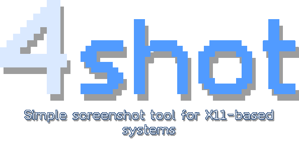

**Small** X11 utility used for taking screenshots.

The only dependencies of `4shot` are **XLib** and **libpng**.

## Modes
- `--full` Just uses fullscreen.
- `--rect` Prompts user to select an area.
    - `LMB` select an area
    - `RMB`/`Enter` take a screenshot
    - `ESC` cancel

## Output
- `--stdout` Outputs PNG image to `stdout`.
- `--file [filename]` Outputs PNG image to a file `filename`.

## How to build
1. Install tools: any C compiler, `cmake`, `make`
2. Install dependencies: `XLib` and `libpng`
3. `cd` into project directory
4. `mdkir build && cd build`
5. `cmake ..`
6. `make` or `make install` if you want to install somewhere in `PATH`.
